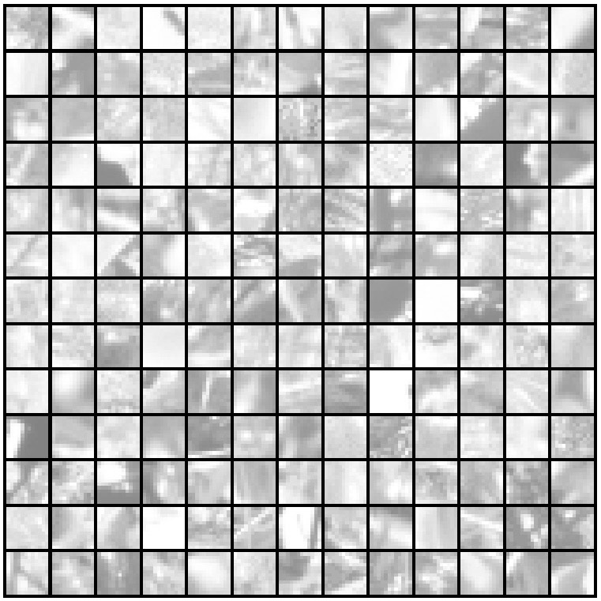
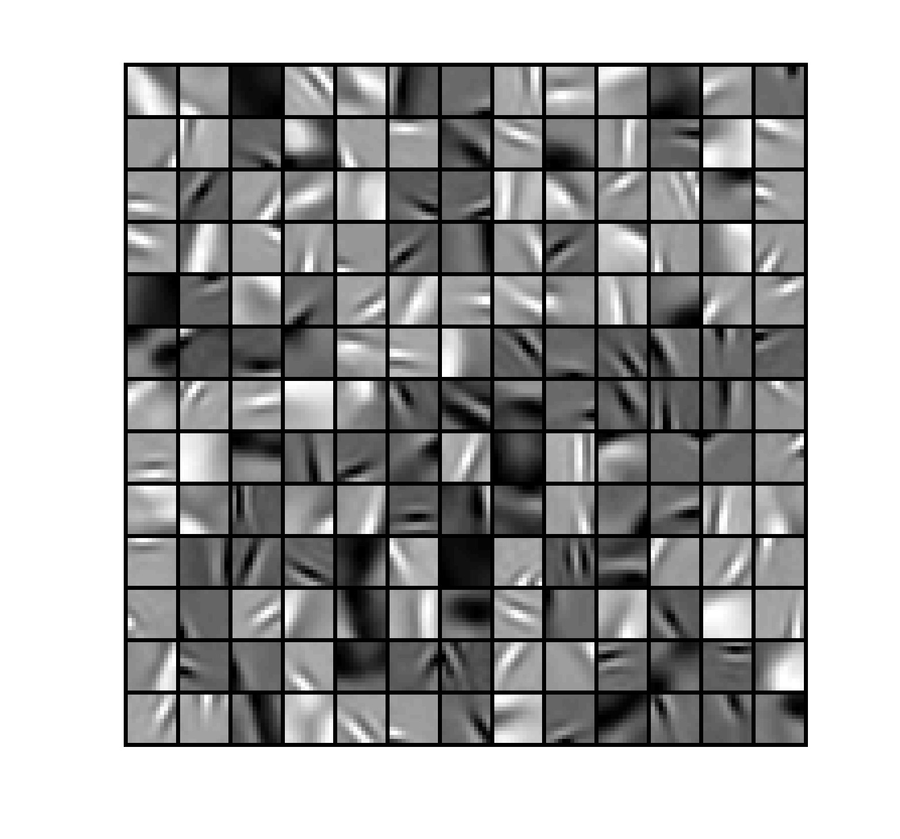

# Sparse Coding Dictionary Learning from Natural Image Patches

This repository contains an implementation of a batch learning algorithm for **sparse coding** on natural image patches. It learns a dictionary of features that can sparsely represent patches of images. The code includes:

1. **Latent signal (sparse codes) updates** using a coordinate descent approach:
   > Li, Y., & Osher, S. (2009). Coordinate descent optimization for $\ell_1$ minimization with application to compressed sensing; a greedy algorithm. *Inverse Problems and Imaging, 3(3), 487-503*.

2. **Dictionary updates** (when the sparse codes and input patches are fixed) based on:
   > Mairal, J., Bach, F., Ponce, J., & Sapiro, G. (2010). Online learning for matrix factorization and sparse coding. *Journal of Machine Learning Research, 11(1)*.

Additionally, it includes a Python reimplementation of the MATLAB function [`display_network.m`](https://www.rctn.org/bruno/sparsenet/) from Bruno Olshausen's *sparsenet* package, which is used to visualize both sample image patches and the learned dictionary features.

---

## Table of Contents

- [Overview](#overview)
- [Dependencies](#dependencies)
- [Installation](#installation)
- [Usage](#usage)
  - [Preparing Image Patches](#preparing-image-patches)
  - [Running the Dictionary Learning](#running-the-dictionary-learning)
  - [Visualizing Results](#visualizing-results)
- [Example Results](#example-results)
- [References](#references)
- [License](#license)
- [Acknowledgments](#acknowledgments)

---

## Overview

This project demonstrates how to learn a sparse coding dictionary from a batch of natural image patches. The pipeline follows these steps:

1. **Sample random batch of patches** from a set of natural images.
2. **Initialize** the dictionary (e.g., random Gaussian or other heuristic).
3. **Alternating Updates**:
   - **Sparse codes update** (coordinate descent for $\ell_1$-regularized minimization).
   - **Dictionary update** (using the approach described by Mairal et al.).
4. **Visualization**: Display a subset of the sampled image patches and the learned dictionary atoms (or filters).

The main goals are:
- To obtain a set of basis functions (dictionary atoms) that can reconstruct the patches with sparse coefficients.
- To explore the structure learned by these atoms from natural images (often edge- or blob-like filters).

---

## Dependencies

- [Python 3.7+](https://www.python.org/)
- [NumPy](https://numpy.org/)
- [SciPy](https://scipy.org/)
- [Matplotlib](https://matplotlib.org/)
- [PyTorch](https://pytorch.org/)
  
---

## Installation

1. **Clone** this repository:
   ```bash
   git clone https://github.com/shanhonghao/image-patch-sparse-coding-batch.git
   cd image-patch-sparse-coding-batch
   ```
2. **Install dependencies** (see above).

---

## Usage

### Preparing Image Patches

- **Option A: Use the provided patches**  
  A file named `data.mat` is included in this repository, containing a set of randomly sampled image patches (no preprocessing has been done on them). If you just want to try out the dictionary learning without creating your own patches, you can use this file directly in the training script (see the next section).

- **Option B: Prepare your own patches**
1. (Optionally) Use your own function to create a NumPy array of shape `(patch_height × patch_width, num_patches)`. 
2. (Optionally) **Preprocess** patches (e.g., normalize, remove DC component, or apply contrast normalization) before learning.

### Running the Dictionary Learning

**Run** the main script:
   ```bash
   python sparse_coding_batch.py
   ```
   This will:
   - Initialize the dictionary.
   - Iteratively perform:
     1. **Sparse coding** with coordinate descent (Li & Osher, 2009).
     2. **Dictionary update** (Mairal et al., 2010).
   - Display the learned dictionary.

### Visualizing Results

The visualization functions rely on the reimplemented **display_network** code, which organizes each patch/atom into a row–column layout and rescales intensities for clear display.

---

## Example Results

Below is a sample grid showing (A) raw patches extracted from natural images and (B) the resulting learned dictionary filters after training:

**A) Sample Patches**



**B) Learned Dictionary**



Typically, these atoms capture edge-like or blob-like structures resembling Gabor filters, consistent with known results in sparse coding of natural images.

---

## References

1. **Li & Osher (2009)**  
   *Coordinate descent optimization for $\ell_1$ minimization with application to compressed sensing; a greedy algorithm.*  
   Y. Li and S. Osher. *Inverse Problems and Imaging, 3(3): 487–503.*

2. **Mairal et al. (2010)**  
   *Online learning for matrix factorization and sparse coding.*  
   J. Mairal, F. Bach, J. Ponce, and G. Sapiro. *Journal of Machine Learning Research, 11(1).*

3. **Olshausen's sparsenet**  
   [https://www.rctn.org/bruno/sparsenet/](https://www.rctn.org/bruno/sparsenet/)  
   The original MATLAB code for `display_network.m` was adapted to Python in this repo.

---

## License

- This project is distributed under the MIT License (see [LICENSE](LICENSE) file for details).
- The original MATLAB `display_network.m` by Bruno Olshausen is referenced and reimplemented in Python here. Please refer to their site and any accompanying license terms.

---

If you have any questions or suggestions, feel free to open an [issue](../../issues) or submit a pull request. Happy coding!