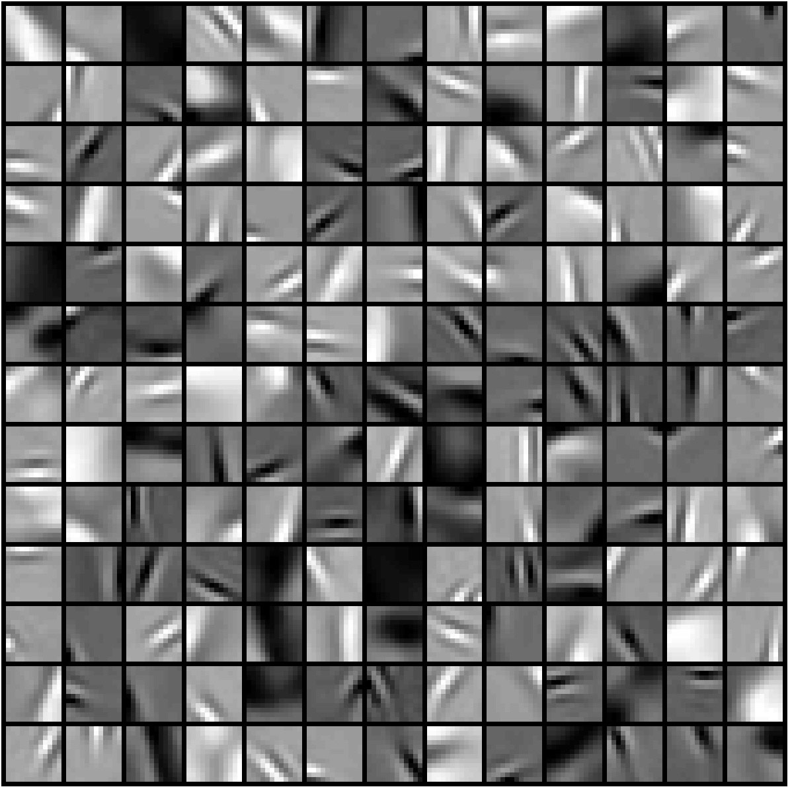

# Sparse Coding Dictionary Learning from Natural Image Patches

This repository provides an implementation of a **batch learning algorithm** for **sparse coding** on natural image patches. It learns a dictionary of features (or "atoms") that can *sparsely* represent patches of images. Key components include:

1. **Latent signal (sparse codes) updates** using a coordinate descent algorithm:
   > Li, Y., & Osher, S. (2009). Coordinate descent optimization for $\ell_1$ minimization with application to compressed sensing; a greedy algorithm. *Inverse Problems and Imaging, 3(3), 487–503*.

2. **Dictionary updates** (with sparse codes and input patches fixed) as described by:
   > Mairal, J., Bach, F., Ponce, J., & Sapiro, G. (2010). Online learning for matrix factorization and sparse coding. *Journal of Machine Learning Research, 11(1)*.

Additionally, the code includes a Python reimplementation of the MATLAB function [`display_network.m`](https://www.rctn.org/bruno/sparsenet/) from Bruno Olshausen's *sparsenet* package, which is used to visualize both sample image patches and the learned dictionary features.

---

## Table of Contents

- [Overview](#overview)
- [Dependencies](#dependencies)
- [Installation](#installation)
- [Usage](#usage)
  - [Preparing Image Patches](#preparing-image-patches)
  - [Running the Dictionary Learning](#running-the-dictionary-learning)
  - [Visualizing Results](#visualizing-results)
- [Example Results](#example-results)
- [References](#references)
- [License](#license)
- [Acknowledgments](#acknowledgments) <!-- Optional if you plan to add acknowledgments -->

---

## Overview

This project demonstrates how to learn a sparse coding dictionary from a batch of natural image patches. The typical workflow includes:

1. **Sampling** random patches from one or more natural images.
2. **Initializing** the dictionary (e.g., random Gaussian or another heuristic).
3. **Alternating updates** of:
   - **Sparse codes** (coordinate descent for $\ell_1$-regularized minimization).
   - **Dictionary** (using the approach described by Mairal et al.).
4. **Visualization**: Displaying a subset of the sampled patches and the learned dictionary filters.

**Goal**: Obtain a set of basis functions (dictionary atoms) that can reconstruct patches with sparse coefficients, while also revealing the typical edge- or blob-like structures learned from natural images.

---

## Dependencies

- [Python 3.7+](https://www.python.org/)
- [NumPy](https://numpy.org/)
- [SciPy](https://scipy.org/)
- [Matplotlib](https://matplotlib.org/)
- [PyTorch](https://pytorch.org/) (used for matrix operations; CPU usage should be sufficient, but a GPU can be used if desired)

---

## Installation

1. **Clone** this repository:
   ```bash
   git clone https://github.com/shanhonghao/image-patch-sparse-coding-batch.git
   cd image-patch-sparse-coding-batch
   ```
2. **Install the required dependencies** (listed above). For example:
   ```bash
   pip install numpy scipy matplotlib torch
   ```
   or install them within a virtual environment such as [conda](https://docs.conda.io/en/latest/).

---

## Usage

### Preparing Image Patches

- **Option A: Use the provided sample patches**  
  A file named `data.mat` is included in this repository, containing a set of randomly sampled image patches (with no additional preprocessing). If you simply want to try out the dictionary learning process, you can use `data.mat` directly.

- **Option B: Prepare your own patches**  
  1. Write or use an existing function to create a NumPy array of shape $(\text{patch height} \times \text{patch width}, \text{num patches})$.  
  2. (Optional) **Preprocess** your patches (e.g., remove the DC component, normalize for contrast, etc.) before training.

### Running the Dictionary Learning

Use the command:
```bash
python sparse_coding_batch.py
```
This will:
1. Initialize the dictionary.
2. Iteratively perform:
   - **Sparse coding** via coordinate descent (Li & Osher, 2009).
   - **Dictionary update** (Mairal et al., 2010).
3. Display the learned dictionary using the visualization script.

You can customize hyperparameters (e.g., number of dictionary atoms, learning rate, number of iterations) in the script. 

### Visualizing Results

The **display_network** function (adapted from Olshausen’s *sparsenet*) neatly arranges patches and dictionary atoms in a grid and rescales intensities for clearer visualization. For example, it is used to:

- Show a subset of the raw patches.
- Visualize the learned dictionary atoms (filters).

---

## Example Results

Below is a sample grid displaying (A) the random patches extracted from natural images and (B) the resulting learned dictionary:

**A) Sample Patches**


**B) Learned Dictionary**



These filters typically capture edge-like or blob-like structures, reminiscent of Gabor filters, which is consistent with well-known results in sparse coding of natural images.

---

## References

1. **Li & Osher (2009)**  
   *Coordinate descent optimization for $\ell_1$ minimization with application to compressed sensing; a greedy algorithm.*  
   Y. Li and S. Osher. *Inverse Problems and Imaging, 3(3): 487–503.*

2. **Mairal et al. (2010)**  
   *Online learning for matrix factorization and sparse coding.*  
   J. Mairal, F. Bach, J. Ponce, and G. Sapiro. *Journal of Machine Learning Research, 11(1).*

3. **Olshausen’s sparsenet**  
   [https://www.rctn.org/bruno/sparsenet/](https://www.rctn.org/bruno/sparsenet/)  
   The original MATLAB code (`display_network.m`) was adapted here for Python.

---

## License

This project is distributed under the [MIT License](LICENSE).  
The original MATLAB `display_network.m` by Bruno Olshausen is referenced and reimplemented in Python in this repository. Please refer to the original site and any accompanying license terms for further details.

---

If you encounter any issues, have questions, or want to suggest improvements, feel free to [open an issue](../../issues) or submit a pull request. Happy coding!